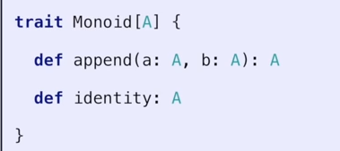
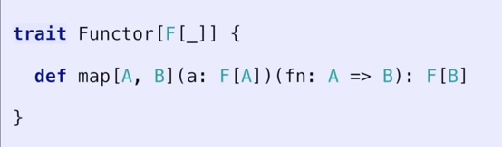
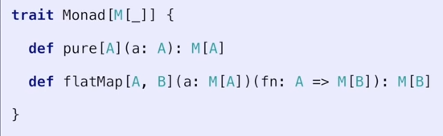

# From Set theory and lamda calculus

## Sets [😎]

Set of a data type 😎 eg Natural Numbers 'N'

## Append Operation ❄

Some binary operation applied to two elements of the set.

## Algebraic data structure (😎,❄) 

eg (N, +)  Natural Numbers and Addition

### Closure Rule on (😎,❄) 

 😎❄😎==😎

operation (Algebraic data structure operation) applied to two items from the Set returns a third element from the set

eg (N, +)  Natural Numbers and Addition

1+2=3 
all are natural numbers 👌 Closure rule is followed by this algebraic data type

### Associativy Rule on (😎,❄) 

😎❄(😎❄😎）== (😎❄😎)❄😎

Ordering of operations in sequence does not matter Eg  1+(2+3)==(1+2)+3

Addition and multiplication are associative. 
Subtraction and Division are not associative 

### Identity Element 👹 in set of [😎] for (😎,❄) 

😎❄👹==😍 ....Note 😍=self

element of Set which when applied in operation on any element of set returns that element

eg 0 for +

## Semigroup of (😎,❄) 

Follows Closure 😎❄😎==😎

Follows Associativity 😎❄(😎❄😎）== (😎❄😎)❄😎

## Monoid of (😎,❄) 

Follows Closure. 😎❄😎==😎

Follows Associativity. 😎❄(😎❄😎）== (😎❄😎)❄😎

And has Identity element👹. 😎❄👹==😎.

**interface Monoid<😎>** dotnet is not able to represent an algebraic data type but the interface would look like
{

 😎 append❄ (😎)***associative***

 😍 append❄ (👹)***identity***   

}
 

### Examples

      object StringConcat extends Monoid[String] {
        def append(a: String, b: String): String = a + b
        def identity: String = ""
      }
       object IntegerAddition extends Monoid[Int] {
        def append(a: Int, b: Int): Int = a + b
        def identity: Int = 0
      }
      object IntegerMultiplication extends Monoid[Int] {
        def append(a: Int, b: Int): Int = a * b
        def identity: Int = 1
      }
      object FunctionComposition /* extends Monoid[_=>_] */ {
        def append[A, B, C](f1: A => B, f2: B => C): A => C =
          (a: A) => f2(f1(a))
        def identity[A]: A => A = { a => a }
      }
      class ListConcat[A] extends Monoid[List[A]] {
        def append(a: List[A], b: List[A]): List[A] = a ++ b
        def identity: List[A] = List.empty[A]
      }

## Functors

Family of types that have implemented the map method

Type Projection C#

      class Functor<T>{
         static Functor<B> Map<A,B>(Functor<A> a, Func<A,B> func) =>  .....   eg  new Functor<B>(func(a))
      }

#### Examples

      IEnumerable<T>.Select
      IObservable<T>.Select
      Task<T>
      Nullable<T>    No map method defined in CLR

The map method applies a function 
      
      Func<a,b>

to a structure

      M<a>

and converts to same structure

      M<b>

 

### Two Properties

1. Identity (no-op value - does not do anything when used with the **map** method) eg func just returns a as Functor < A > type;
2. **Composition**: Grouping of **map** does not matter 

### Examples

      sealed trait Option[+A]
      case class Some[A](a: A) extends Option[A]
      case object None extends Option[Nothing]
      object OptionFunctor extends Functor[Option] {
        def pure[A](a: A): Option[A] = Some(a)
        def identity[A]: A => A = (a: A) => a

        def map[A, B](a: Option[A])(fn: A => B): Option[B] =
          flatMap(a) { b: A => pure(fn(b)) }

        def flatMap[A, B](a: Option[A])(fn: A => Option[B]): Option[B] =
          a match {
            case Some(something) => fn(something)
            case None            => None
          }
      }

## Applicatives

Type Def of functions

      static Applicative<A> pure(A a)=> new Applicative<A>(a)
      static Applicative<B> Apply(this Applicative<A> a, Applicative<Func<A,B>> func)=> new Applicative<B>(func(a))
 

## Monads  

Type Def of functions

      static Monad<A> pure(A a)=> ....
      static Monad<B> FlatMap(Monad<A> a, Func<A,Monad<B> func)=> ...

 

### Two Properties

1. Identity (no-op value - does not do anything when used with the **flatmap** method)
2. **Composition**: Grouping of **flatmaps** does not matter 

(somtimes called applicative with FlatMap called apply)

I prefer the name Bind to FlatMap

__NAH...Burritos are just tacoids in the category of enchiladafunctors.__

Monads are just a container, context or collection that implements two methods

All told, a monad in X is just a monoid in the category of endofunctors of X, with product × replaced by composition of endofunctors and unit set by the identity endofunctor.

 ## Maths 

| Tables        | Are           | Cool  |
| ------------- |:-------------:| -----:|
| Commutative     | order does not matter | f(a,b)=f(b,a) |
| Associativty | Grouping does not matter | f(f((a,b)),c)  = f(a,f((b,c))) |
| identity | where to start |  f (a,i) = a |
| Inverse | going back and forth | g(f(a)) = a |
| Idempotence | duplicates dont matter | f(f(a))= f(a) |
| Zero Value | when to stop | f(a,z) = z |
| Stucture preservation | rearranging work | split task see https://www.youtube.com/watch?v=epT1xgxSpFU |

## F# Functional languages have Sum Types with pattern matching 

Allows functional languagest to write a function that will work on all functors.

eg  Add1 then convert to word on IEnumerable AND IObservable of ints

 
[Functional Programming Patterns for Mere Mortals - Daniel Chambers](https://www.youtube.com/watch?v=v9QGWbGppis)

      type Option<'a> =
      | Some of <'a>
      | None

      match optional with 
      | Some x -> x+1
      | None => 0

      type Choice<'a,'b> =
        | Choice1of2 of 'a
        | Choice2o2 of 'b

## C# i.e. my Sum Types

      Maybe<T>
   
      eg maybe.Map(x=>x.Name)

      Result<T> 

      eg result.Map(x=> x+1)

## F# Functional languages higher kinded types

Not sirectly possible in dotnet, but can use the pattern

Essentially is in haskell and scala

More powerfull than generics

## Resources
Scala Days
[Why the free Monad isn't free](https://www.youtube.com/watch?v=U0lK0hnbc4U&t=2117s)

[Code](http://github.com/robinske/monad-examples)