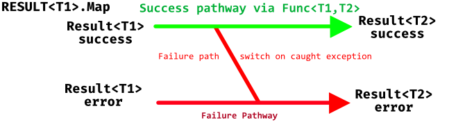
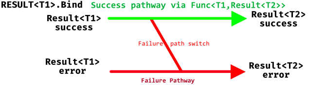
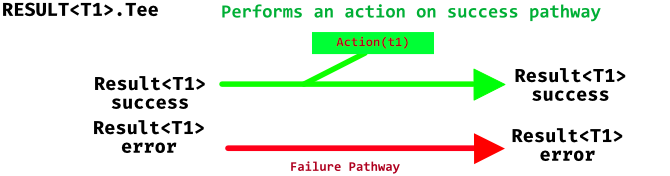

# DCP.CoMonad


C# Functional Extensions for the 'Happy Path' 
=============================================

Combinatorial Monads for Result, Task, Linq and IAsyncEnumerable. Inspired by Scott Wlaschin and railway oriented program design principles. Uses latest features of C# to adopt new paradigms based on functional monadic design. Retains minimalist design. Easy learning and migration curve.

## Index

* [Functional](#functional)
* [Introduction](#introduction)
* [No Exception](#no-exceptions)
* [No Option](#no-option)
* [No Complexity](#no-complexity)
* [Failure!](#failure)
* [Worlds Collide](#worlds-collide)
* [Monads](#monads)
* [Reference Videos by others](#reference-videos-by-others)


## Functional

__What is functional programming anyway?__

1. Style

    A __style__ that treats computation as the evaluation of mathematical functions and avoids changing-state and mutable data.
    
    Because it is just a __style__ there is no requirement to use a 'functional language', although these may have defaults to immutability and even compiler restrictions that simplify or enforce the __style__.
    
    The terms 'Pure', 'deterministic', 'referential transparency' are fancy descriptors for this style.

2. First Class Functions and Higher-order functions

    An __ability__ to pass and receive functions as parameters.
    
    .Net and indeed most languages possess this ability. Func&lt;T..n&gt; and delegates represent this ability in .Net
    
The important thing to note is that .Net (C# in particular) is fully capable of functional programming style and technique.


## Introduction ##

Functional programming style primary benefit is enhancing code readability and ability to reason about.

The composition throughout our programs is really important. We need to be confident that each piece of code and the composition of code is correct.

Having one small piece of code that is easy to read and reason about is very easy to achieve in practically any dynamic. 

Dealing with large code bases maintained by multiple developers is intrinsically more difficult.

Functional style shines 😊 in this regard.


## No Exceptions ##

Using the Result&lt;T&gt; struct type. This type represents a discriminated union of either success or error and allows us to adopt railway oriented programming. Chain function calls and reduce code paths to a single railway track. 

Result&lt;T&gt; implements Map, Bind, Combine and their async counter-parts

With these few methods we can transform code to more functional happy paths.

eg Checked Math simple example

```C#
    Result<int> Divide(int a,int b)=>b==0?RezErr.DivideByZero:Result.Ok(a/b);
    //C# will not overflow unless using checked math
    Result<int> Add(int a,int b)=>b==try{return Result.Ok(checked(a+b));catch(System.OverflowException){return RezErr.Overflow;}

    Result<int> AddDivide(int a,int b,int c)=> Add(a,b).Bind(r=>Divide(r,c));
```

The key thing to recognise is that this code will not throw errors yet will performed checked maths.

Indeed the primary requirement for this design style is that ___'All methods returning Result&lt;T&gt; do not throw errors'___.

Once this requirement is in place we can remove all error handling of exceptions when calling these methods and simply handle the end case result no matter how long the function call chain.

Transitioning to returning Result&lt;T&gt; from functions is simple to implement and peppers your code with ability to chain function calls using the map and bind.

Once using this mechanism with chained function calls your ability to reason about code and follow the code path is enhanced.

Scott Wlaschin describes this as moving 'up' into a new parallel world which is a nice concept.


## No Option ##

What! No Option or Maybe.

This library contains no option or maybe. This is a design decision to enforce transition to use of nullable reference types.

Nullable reference types in effect make the option or maybe types irrelevant. Of course this requires implementing nullable reference types correctly

## No Complexity

Well... Not Really.

This library only requires you to master a simple paradigm.

* Return Result&lt;T&gt; type from your functions. 

* Enforce the rule - 'no exceptions' thrown from these methods.

* Use Map, Bind, Combine, Tee and their async counter-parts to combine your function calls in call chains.


### Map



### Bind

 

### Tee

**Action and return in C#**



## Failure

How to indicate failure pathway? There are many other 'functional' libraries with their own methodologies and no standardized way.

This library uses a simple construct that can encapsulate a string and / or an exception. 

You can create your own class for Error handling easily - just derive from the abstract RezErrorBase class.

To return an error, simply return RezErrBase eg RezErr.OverThrow which is implicitly converted to the appropriate Result&lt;T&gt;

## Worlds Collide

Handling transitions from values to Result

```C#
    var r = Result.Ok("Hello World");
```

Handling transitions from sync to async

```C#
    public async Task<Result<string>> GetWebPage(Uri) {.......}
    public Result<Uri> GetUri(string url) { ......}
     public Result<int> ProcessPage(string content) { ......}
    //within an async method
    var r = GetUri(uri)//in the world of Result now
                .BindAsync(GetWebPage) //in the world of async Result now
                .BindAsync(ProcessPage);//remain in the async Result world
    //Question what is r
    //Answer : Task<Result<string>>
    //no async code has executed - page not retrieved and not processed - C# has become Lazy
    var finalresult = await r;
```


## Monads all the way ##


[Read the basics](https://github.com/ak98/DCP.CoMonad/blob/master/monads.md)


## Reference Videos by others

[Functional Design Patterns - Scott Wlaschin](https://www.youtube.com/watch?v=srQt1NAHYC0&t=2705s) The original.


[Railway-Oriented Programming in C# - Marcus Denny](https://www.youtube.com/watch?v=uM906cqdFWE)

[The Power of Composition - Scott Wlaschin](https://www.youtube.com/watch?v=vDe-4o8Uwl8&t=2980s)

[Vladimir Khomrikov on Pluralsight](https://app.pluralsight.com/library/courses/csharp-applying-functional-principles/table-of-contents)


